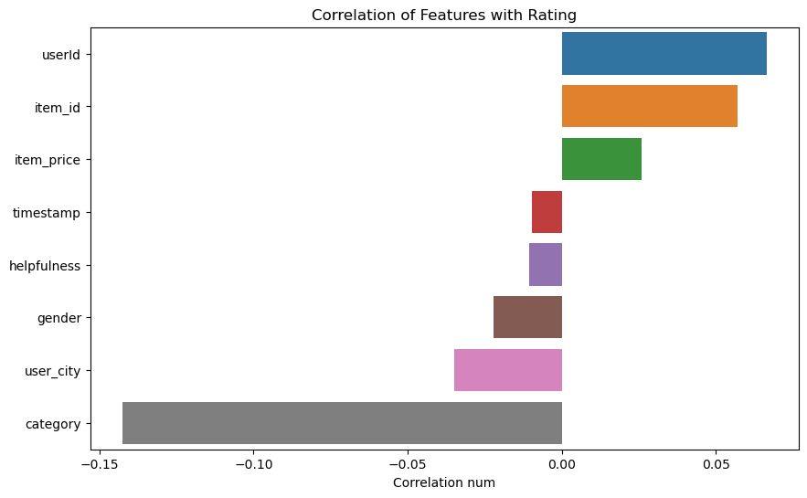
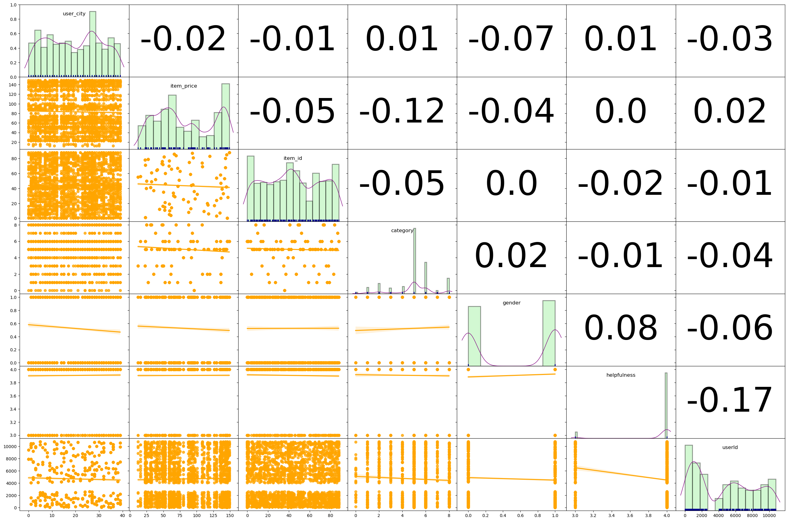
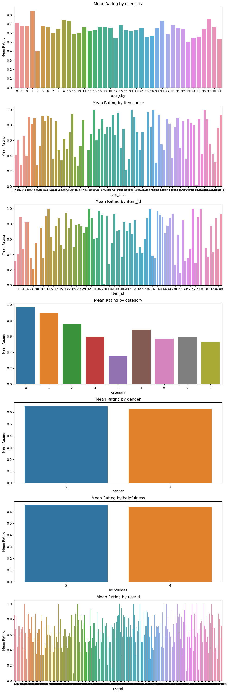
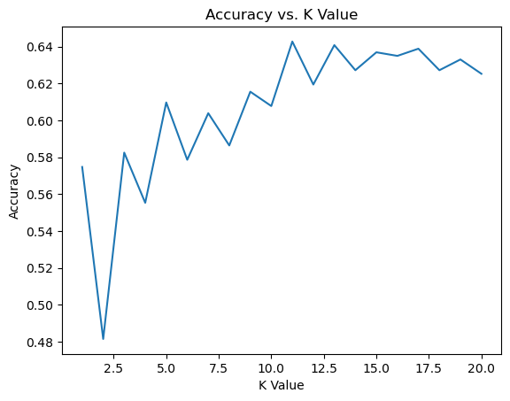
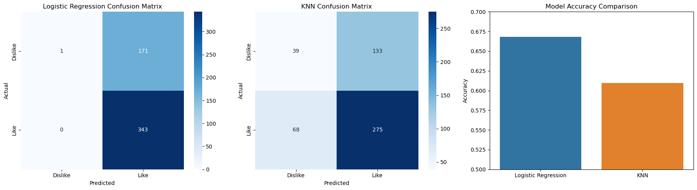
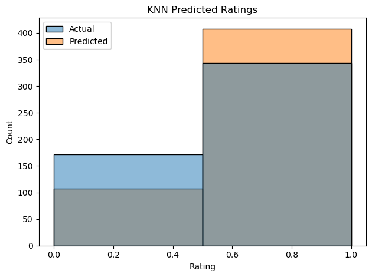

## Analysis of an E-commerce Dataset Part 3 (s2 2023)


In this Portfolio task, you will continue working with the dataset you have used in portfolio 2. But the difference is that the ratings have been converted to like (with score 1) and dislike (with score 0). Your task is to train classification models such as KNN to predict whether a user like or dislike an item.  


The header of the csv file is shown below. 

| userId | timestamp | review | item | helpfulness | gender | category | item_id | item_price | user_city | rating |
    | ---- | ---- | ---- | ---- | ---- | ---- | ---- | ---- | ---- | ---- | ---- |
    
Your high level goal in this notebook is to try to build and evaluate predictive models for 'rating' from other available features - predict the value of the like (corresponding to rating 1) and dislike (corresponding to rating 0) in the data from some of the other fields. More specifically, you need to complete the following major steps: 
1) Explore the data. Clean the data if necessary. For example, remove abnormal instanaces and replace missing values.
2) Convert object features into digit features by using an encoder
3) Study the correlation between these features. 
4) Split the dataset and train a logistic regression model to predict 'rating' based on other features. Evaluate the accuracy of your model.
5) Split the dataset and train a KNN model to predict 'rating' based on other features. You can set K with an ad-hoc manner in this step. Evaluate the accuracy of your model.
6) Tune the hyper-parameter K in KNN to see how it influences the prediction performance

Note 1: We did not provide any description of each step in the notebook. You should learn how to properly comment your notebook by yourself to make your notebook file readable. 

Note 2: you are not being evaluated on the ___accuracy___ of the model but on the ___process___ that you use to generate it. Please use both ___Logistic Regression model___ and ___KNN model___ for solving this classification problem. Accordingly, discuss the performance of these two methods.
    


```python
import pandas as pd
import numpy as np
from sklearn.model_selection import train_test_split
from sklearn import linear_model
from sklearn.metrics import r2_score

from sklearn.preprocessing import LabelEncoder
from sklearn.linear_model import LogisticRegression
from sklearn.neighbors import KNeighborsClassifier
from sklearn.metrics import accuracy_score, classification_report, confusion_matrix
from sklearn.model_selection import cross_val_score


import seaborn as sns
import matplotlib.pylab as plt
%matplotlib inline
```

#### **Outline**

- describe and display each set of data
- change caterogry to numerical for later trainings
- KNN and Logistic Regression ( 80, 20 splits)

# Descriptive Data


```python
df = pd.read_csv('Data/portfolio_3.csv')
```


```python
display(df)
```


<div>
<style scoped>
    .dataframe tbody tr th:only-of-type {
        vertical-align: middle;
    }

    .dataframe tbody tr th {
        vertical-align: top;
    }

    .dataframe thead th {
        text-align: right;
    }
</style>
<table border="1" class="dataframe">
  <thead>
    <tr style="text-align: right;">
      <th></th>
      <th>userId</th>
      <th>timestamp</th>
      <th>review</th>
      <th>item</th>
      <th>helpfulness</th>
      <th>gender</th>
      <th>category</th>
      <th>item_id</th>
      <th>item_price</th>
      <th>user_city</th>
      <th>rating</th>
    </tr>
  </thead>
  <tbody>
    <tr>
      <th>0</th>
      <td>4081</td>
      <td>71900</td>
      <td>Not always McCrap</td>
      <td>McDonald's</td>
      <td>3</td>
      <td>M</td>
      <td>Restaurants &amp; Gourmet</td>
      <td>41</td>
      <td>30.74</td>
      <td>4</td>
      <td>1</td>
    </tr>
    <tr>
      <th>1</th>
      <td>4081</td>
      <td>72000</td>
      <td>I dropped the chalupa even before he told me to</td>
      <td>Taco Bell</td>
      <td>4</td>
      <td>M</td>
      <td>Restaurants &amp; Gourmet</td>
      <td>74</td>
      <td>108.30</td>
      <td>4</td>
      <td>0</td>
    </tr>
    <tr>
      <th>2</th>
      <td>4081</td>
      <td>72000</td>
      <td>The Wonderful World of Wendy</td>
      <td>Wendy's</td>
      <td>4</td>
      <td>M</td>
      <td>Restaurants &amp; Gourmet</td>
      <td>84</td>
      <td>69.00</td>
      <td>4</td>
      <td>1</td>
    </tr>
    <tr>
      <th>3</th>
      <td>4081</td>
      <td>100399</td>
      <td>They actually did it</td>
      <td>South Park: Bigger, Longer &amp; Uncut</td>
      <td>3</td>
      <td>M</td>
      <td>Movies</td>
      <td>68</td>
      <td>143.11</td>
      <td>4</td>
      <td>1</td>
    </tr>
    <tr>
      <th>4</th>
      <td>4081</td>
      <td>100399</td>
      <td>Hey! Gimme some pie!</td>
      <td>American Pie</td>
      <td>3</td>
      <td>M</td>
      <td>Movies</td>
      <td>6</td>
      <td>117.89</td>
      <td>4</td>
      <td>0</td>
    </tr>
    <tr>
      <th>...</th>
      <td>...</td>
      <td>...</td>
      <td>...</td>
      <td>...</td>
      <td>...</td>
      <td>...</td>
      <td>...</td>
      <td>...</td>
      <td>...</td>
      <td>...</td>
      <td>...</td>
    </tr>
    <tr>
      <th>2680</th>
      <td>2445</td>
      <td>22000</td>
      <td>Great movie!</td>
      <td>Austin Powers: The Spy Who Shagged Me</td>
      <td>3</td>
      <td>M</td>
      <td>Movies</td>
      <td>9</td>
      <td>111.00</td>
      <td>5</td>
      <td>1</td>
    </tr>
    <tr>
      <th>2681</th>
      <td>2445</td>
      <td>30700</td>
      <td>Good food!</td>
      <td>Outback Steakhouse</td>
      <td>3</td>
      <td>M</td>
      <td>Restaurants &amp; Gourmet</td>
      <td>50</td>
      <td>25.00</td>
      <td>5</td>
      <td>1</td>
    </tr>
    <tr>
      <th>2682</th>
      <td>2445</td>
      <td>61500</td>
      <td>Great movie!</td>
      <td>Fight Club</td>
      <td>3</td>
      <td>M</td>
      <td>Movies</td>
      <td>26</td>
      <td>97.53</td>
      <td>5</td>
      <td>1</td>
    </tr>
    <tr>
      <th>2683</th>
      <td>2445</td>
      <td>100500</td>
      <td>Awesome Game.</td>
      <td>The Sims 2: Open for Business for Windows</td>
      <td>4</td>
      <td>M</td>
      <td>Games</td>
      <td>79</td>
      <td>27.00</td>
      <td>5</td>
      <td>1</td>
    </tr>
    <tr>
      <th>2684</th>
      <td>2445</td>
      <td>101400</td>
      <td>Great Service.</td>
      <td>PayPal</td>
      <td>3</td>
      <td>M</td>
      <td>Personal Finance</td>
      <td>52</td>
      <td>38.00</td>
      <td>5</td>
      <td>1</td>
    </tr>
  </tbody>
</table>
<p>2685 rows × 11 columns</p>
</div>


```python
df.info()

# 11 columns, Goal -> predict 'rating' based on other features (for each Columns against 'rating')
```

    <class 'pandas.core.frame.DataFrame'>
    RangeIndex: 2685 entries, 0 to 2684
    Data columns (total 11 columns):
     #   Column       Non-Null Count  Dtype  
    ---  ------       --------------  -----  
     0   userId       2685 non-null   int64  
     1   timestamp    2685 non-null   int64  
     2   review       2685 non-null   object 
     3   item         2685 non-null   object 
     4   helpfulness  2685 non-null   int64  
     5   gender       2685 non-null   object 
     6   category     2685 non-null   object 
     7   item_id      2685 non-null   int64  
     8   item_price   2685 non-null   float64
     9   user_city    2685 non-null   int64  
     10  rating       2685 non-null   int64  
    dtypes: float64(1), int64(6), object(4)
    memory usage: 230.9+ KB
    


```python
for col in df.columns:
    print(f"The column '{col}' has {len(df[col].unique())} unique values.")

```

    The column 'userId' has 267 unique values.
    The column 'timestamp' has 844 unique values.
    The column 'review' has 2675 unique values.
    The column 'item' has 82 unique values.
    The column 'helpfulness' has 2 unique values.
    The column 'gender' has 2 unique values.
    The column 'category' has 9 unique values.
    The column 'item_id' has 82 unique values.
    The column 'item_price' has 77 unique values.
    The column 'user_city' has 40 unique values.
    The column 'rating' has 2 unique values.
    

binary 'ratings', like/dislike, 1 or 0


```python
# checking for null values
df.isnull().sum()
```


    userId         0
    timestamp      0
    review         0
    item           0
    helpfulness    0
    gender         0
    category       0
    item_id        0
    item_price     0
    user_city      0
    rating         0
    dtype: int64


no null values


```python
df['rating'].describe()
```


    count    2685.000000
    mean        0.639851
    std         0.480133
    min         0.000000
    25%         0.000000
    50%         1.000000
    75%         1.000000
    max         1.000000
    Name: rating, dtype: float64


2685 total ratings, more likes compare to dislikes (mean > .5)


- user_city is numerical

- items are represent by item_id (item could be dropped)

- need to encode only Gender, Category and Reviews


```python
# Check for potential abnormality (negative prices and Free stuff ?)
display(df[df['item_price'] <= 0])
```


<div>
<style scoped>
    .dataframe tbody tr th:only-of-type {
        vertical-align: middle;
    }

    .dataframe tbody tr th {
        vertical-align: top;
    }

    .dataframe thead th {
        text-align: right;
    }
</style>
<table border="1" class="dataframe">
  <thead>
    <tr style="text-align: right;">
      <th></th>
      <th>userId</th>
      <th>timestamp</th>
      <th>review</th>
      <th>item</th>
      <th>helpfulness</th>
      <th>gender</th>
      <th>category</th>
      <th>item_id</th>
      <th>item_price</th>
      <th>user_city</th>
      <th>rating</th>
    </tr>
  </thead>
  <tbody>
  </tbody>
</table>
</div>


```python
# How many cities ?

len(df['user_city'].unique())
```


    40


```python
len(df['review'].unique())
```


    2675


```python
len(df['timestamp'].unique())
```


    844


there are some duplicated reviews... however it is almost 1 to 1,

10 dups in total, no effective method learnt to predict unique reviews against rating yet. . . 

### will skip reviews

## Transformation encoder


```python
from sklearn.preprocessing import LabelEncoder

label_encoder = LabelEncoder()

# Encode categorical features
categorical_columns = ['gender', 'category', 'review']
for col in categorical_columns:
    df[col] = label_encoder.fit_transform(df[col])

```


```python
display(df)
```


<div>
<style scoped>
    .dataframe tbody tr th:only-of-type {
        vertical-align: middle;
    }

    .dataframe tbody tr th {
        vertical-align: top;
    }

    .dataframe thead th {
        text-align: right;
    }
</style>
<table border="1" class="dataframe">
  <thead>
    <tr style="text-align: right;">
      <th></th>
      <th>userId</th>
      <th>timestamp</th>
      <th>review</th>
      <th>item</th>
      <th>helpfulness</th>
      <th>gender</th>
      <th>category</th>
      <th>item_id</th>
      <th>item_price</th>
      <th>user_city</th>
      <th>rating</th>
    </tr>
  </thead>
  <tbody>
    <tr>
      <th>0</th>
      <td>4081</td>
      <td>71900</td>
      <td>1618</td>
      <td>McDonald's</td>
      <td>3</td>
      <td>1</td>
      <td>8</td>
      <td>41</td>
      <td>30.74</td>
      <td>4</td>
      <td>1</td>
    </tr>
    <tr>
      <th>1</th>
      <td>4081</td>
      <td>72000</td>
      <td>1125</td>
      <td>Taco Bell</td>
      <td>4</td>
      <td>1</td>
      <td>8</td>
      <td>74</td>
      <td>108.30</td>
      <td>4</td>
      <td>0</td>
    </tr>
    <tr>
      <th>2</th>
      <td>4081</td>
      <td>72000</td>
      <td>2185</td>
      <td>Wendy's</td>
      <td>4</td>
      <td>1</td>
      <td>8</td>
      <td>84</td>
      <td>69.00</td>
      <td>4</td>
      <td>1</td>
    </tr>
    <tr>
      <th>3</th>
      <td>4081</td>
      <td>100399</td>
      <td>2243</td>
      <td>South Park: Bigger, Longer &amp; Uncut</td>
      <td>3</td>
      <td>1</td>
      <td>5</td>
      <td>68</td>
      <td>143.11</td>
      <td>4</td>
      <td>1</td>
    </tr>
    <tr>
      <th>4</th>
      <td>4081</td>
      <td>100399</td>
      <td>1033</td>
      <td>American Pie</td>
      <td>3</td>
      <td>1</td>
      <td>5</td>
      <td>6</td>
      <td>117.89</td>
      <td>4</td>
      <td>0</td>
    </tr>
    <tr>
      <th>...</th>
      <td>...</td>
      <td>...</td>
      <td>...</td>
      <td>...</td>
      <td>...</td>
      <td>...</td>
      <td>...</td>
      <td>...</td>
      <td>...</td>
      <td>...</td>
      <td>...</td>
    </tr>
    <tr>
      <th>2680</th>
      <td>2445</td>
      <td>22000</td>
      <td>968</td>
      <td>Austin Powers: The Spy Who Shagged Me</td>
      <td>3</td>
      <td>1</td>
      <td>5</td>
      <td>9</td>
      <td>111.00</td>
      <td>5</td>
      <td>1</td>
    </tr>
    <tr>
      <th>2681</th>
      <td>2445</td>
      <td>30700</td>
      <td>920</td>
      <td>Outback Steakhouse</td>
      <td>3</td>
      <td>1</td>
      <td>8</td>
      <td>50</td>
      <td>25.00</td>
      <td>5</td>
      <td>1</td>
    </tr>
    <tr>
      <th>2682</th>
      <td>2445</td>
      <td>61500</td>
      <td>968</td>
      <td>Fight Club</td>
      <td>3</td>
      <td>1</td>
      <td>5</td>
      <td>26</td>
      <td>97.53</td>
      <td>5</td>
      <td>1</td>
    </tr>
    <tr>
      <th>2683</th>
      <td>2445</td>
      <td>100500</td>
      <td>372</td>
      <td>The Sims 2: Open for Business for Windows</td>
      <td>4</td>
      <td>1</td>
      <td>1</td>
      <td>79</td>
      <td>27.00</td>
      <td>5</td>
      <td>1</td>
    </tr>
    <tr>
      <th>2684</th>
      <td>2445</td>
      <td>101400</td>
      <td>959</td>
      <td>PayPal</td>
      <td>3</td>
      <td>1</td>
      <td>7</td>
      <td>52</td>
      <td>38.00</td>
      <td>5</td>
      <td>1</td>
    </tr>
  </tbody>
</table>
<p>2685 rows × 11 columns</p>
</div>


```python
df_dropped = df.drop(['review', 'item'], axis=1)
```


```python
# Create an empty dictionary to store the results
mean_rating_by_column = {}

# Loop through each column (excluding the 'rating' column)
for col in df_dropped.columns:
    if col != 'rating':
        # Compute the mean rating for each unique value in the column
        mean_rating = df_dropped.groupby(col)['rating'].mean()
        # Store the result in the dictionary
        mean_rating_by_column[col] = mean_rating

# Now mean_rating_by_column contains the mean rating for each unique value in each feature column

```


```python
for col, mean_rating in mean_rating_by_column.items():
    print(f"Mean Rating by {col}:")
    print(mean_rating.to_frame().reset_index())
    print("-----")

```

    Mean Rating by userId:
         userId    rating
    0         4  0.857143
    1        50  0.666667
    2        56  0.846154
    3        74  0.583333
    4        75  0.444444
    ..      ...       ...
    262   10708  0.875000
    263   10710  0.800000
    264   10759  0.714286
    265   10763  0.555556
    266   10779  0.714286
    
    [267 rows x 2 columns]
    -----
    Mean Rating by timestamp:
         timestamp    rating
    0        10100  0.500000
    1        10101  0.500000
    2        10102  0.000000
    3        10107  0.000000
    4        10110  0.000000
    ..         ...       ...
    839     123000  1.000000
    840     123099  0.500000
    841     123100  0.666667
    842     123101  0.000000
    843     123199  0.555556
    
    [844 rows x 2 columns]
    -----
    Mean Rating by helpfulness:
       helpfulness    rating
    0            3  0.655870
    1            4  0.638228
    -----
    Mean Rating by gender:
       gender    rating
    0       0  0.651017
    1       1  0.629709
    -----
    Mean Rating by category:
       category    rating
    0         0  0.965517
    1         1  0.889831
    2         2  0.751323
    3         3  0.598131
    4         4  0.350746
    5         5  0.687395
    6         6  0.573684
    7         7  0.587302
    8         8  0.526316
    -----
    Mean Rating by item_id:
        item_id    rating
    0         0  0.311828
    1         1  0.402778
    2         3  0.888889
    3         4  0.473684
    4         5  0.822222
    ..      ...       ...
    77       84  0.771429
    78       85  0.428571
    79       86  0.875000
    80       87  0.473684
    81       88  0.929577
    
    [82 rows x 2 columns]
    -----
    Mean Rating by item_price:
        item_price    rating
    0        12.00  0.416667
    1        15.42  0.600000
    2        22.38  0.285714
    3        23.00  0.657143
    4        23.08  0.402778
    ..         ...       ...
    72      144.28  0.550000
    73      145.00  0.428571
    74      145.84  0.311828
    75      147.00  0.766667
    76      149.00  0.929577
    
    [77 rows x 2 columns]
    -----
    Mean Rating by user_city:
        user_city    rating
    0           0  0.709677
    1           1  0.676056
    2           2  0.676471
    3           3  0.842697
    4           4  0.400000
    5           5  0.673684
    6           6  0.666667
    7           7  0.596330
    8           8  0.638889
    9           9  0.743902
    10         10  0.732143
    11         11  0.592105
    12         12  0.597701
    13         13  0.666667
    14         14  0.617647
    15         15  0.630435
    16         16  0.666667
    17         17  0.661765
    18         18  0.659574
    19         19  0.543210
    20         20  0.682927
    21         21  0.631579
    22         22  0.619048
    23         23  0.632911
    24         24  0.655556
    25         25  0.553846
    26         26  0.561644
    27         27  0.652695
    28         28  0.735632
    29         29  0.585714
    30         30  0.687500
    31         31  0.653846
    32         32  0.646465
    33         33  0.500000
    34         34  0.542857
    35         35  0.560606
    36         36  0.638298
    37         37  0.756098
    38         38  0.666667
    39         39  0.533333
    -----
    


```python
display(df_dropped)
```


<div>
<style scoped>
    .dataframe tbody tr th:only-of-type {
        vertical-align: middle;
    }

    .dataframe tbody tr th {
        vertical-align: top;
    }

    .dataframe thead th {
        text-align: right;
    }
</style>
<table border="1" class="dataframe">
  <thead>
    <tr style="text-align: right;">
      <th></th>
      <th>userId</th>
      <th>timestamp</th>
      <th>helpfulness</th>
      <th>gender</th>
      <th>category</th>
      <th>item_id</th>
      <th>item_price</th>
      <th>user_city</th>
      <th>rating</th>
    </tr>
  </thead>
  <tbody>
    <tr>
      <th>0</th>
      <td>4081</td>
      <td>71900</td>
      <td>3</td>
      <td>1</td>
      <td>8</td>
      <td>41</td>
      <td>30.74</td>
      <td>4</td>
      <td>1</td>
    </tr>
    <tr>
      <th>1</th>
      <td>4081</td>
      <td>72000</td>
      <td>4</td>
      <td>1</td>
      <td>8</td>
      <td>74</td>
      <td>108.30</td>
      <td>4</td>
      <td>0</td>
    </tr>
    <tr>
      <th>2</th>
      <td>4081</td>
      <td>72000</td>
      <td>4</td>
      <td>1</td>
      <td>8</td>
      <td>84</td>
      <td>69.00</td>
      <td>4</td>
      <td>1</td>
    </tr>
    <tr>
      <th>3</th>
      <td>4081</td>
      <td>100399</td>
      <td>3</td>
      <td>1</td>
      <td>5</td>
      <td>68</td>
      <td>143.11</td>
      <td>4</td>
      <td>1</td>
    </tr>
    <tr>
      <th>4</th>
      <td>4081</td>
      <td>100399</td>
      <td>3</td>
      <td>1</td>
      <td>5</td>
      <td>6</td>
      <td>117.89</td>
      <td>4</td>
      <td>0</td>
    </tr>
    <tr>
      <th>...</th>
      <td>...</td>
      <td>...</td>
      <td>...</td>
      <td>...</td>
      <td>...</td>
      <td>...</td>
      <td>...</td>
      <td>...</td>
      <td>...</td>
    </tr>
    <tr>
      <th>2680</th>
      <td>2445</td>
      <td>22000</td>
      <td>3</td>
      <td>1</td>
      <td>5</td>
      <td>9</td>
      <td>111.00</td>
      <td>5</td>
      <td>1</td>
    </tr>
    <tr>
      <th>2681</th>
      <td>2445</td>
      <td>30700</td>
      <td>3</td>
      <td>1</td>
      <td>8</td>
      <td>50</td>
      <td>25.00</td>
      <td>5</td>
      <td>1</td>
    </tr>
    <tr>
      <th>2682</th>
      <td>2445</td>
      <td>61500</td>
      <td>3</td>
      <td>1</td>
      <td>5</td>
      <td>26</td>
      <td>97.53</td>
      <td>5</td>
      <td>1</td>
    </tr>
    <tr>
      <th>2683</th>
      <td>2445</td>
      <td>100500</td>
      <td>4</td>
      <td>1</td>
      <td>1</td>
      <td>79</td>
      <td>27.00</td>
      <td>5</td>
      <td>1</td>
    </tr>
    <tr>
      <th>2684</th>
      <td>2445</td>
      <td>101400</td>
      <td>3</td>
      <td>1</td>
      <td>7</td>
      <td>52</td>
      <td>38.00</td>
      <td>5</td>
      <td>1</td>
    </tr>
  </tbody>
</table>
<p>2685 rows × 9 columns</p>
</div>


```python
# correlation matrix in heatmap

corr_matrix = df_dropped.corr()

# Get the correlation of all features with 'rating'
corr_with_rating = corr_matrix['rating'].sort_values(ascending=False)

# Drop the 'rating' to 'rating' correlation (it will be 1)
corr_with_rating = corr_with_rating.drop('rating')

# Create a bar plot for the correlations with 'rating'
plt.figure(figsize=(10, 6))
sns.barplot(x=corr_with_rating.values, y=corr_with_rating.index)
plt.title('Correlation of Features with Rating')
plt.xlabel('Correlation num')
plt.show()

```


    

    


### Category, User ID and item_id has the highest correlation, worth investigating


```python
import warnings
warnings.filterwarnings('ignore')

# Adapting the code to our dataset's columns
selected_columns = ['user_city', 'item_price', 'item_id', 'category', 'gender', 'helpfulness', 'userId']

def corrdot(*args, **kwargs):
    corr_r = args[0].corr(args[1], 'pearson')
    corr_text = round(corr_r, 2)
    ax = plt.gca()
    ax.annotate(corr_text, [.5, .5,],  xycoords="axes fraction",
                ha='center', va='center', fontsize=80)

g = sns.PairGrid(df_dropped[selected_columns], aspect=1.5, diag_sharey=False, despine=False)
g.map_diag(sns.distplot, color='lightgreen',
           kde_kws={'color': 'purple', 'cut': 0.7, 'lw': 1},
           hist_kws={'histtype': 'bar', 'lw': 2,
                     'edgecolor': 'k', 'facecolor':'lightgreen'})
g.map_diag(sns.rugplot, color='darkblue')
g.map_lower(sns.regplot, color='orange')
g.map_upper(corrdot)
g.fig.subplots_adjust(wspace=0, hspace=0)

# Add titles to the diagonal axes/subplots
for ax, col in zip(np.diag(g.axes), selected_columns):
    ax.set_title(col, y=0.82, fontsize=12)

# Remove axis labels
for ax in g.axes.flatten():
    ax.set_ylabel('')
    ax.set_xlabel('')

```


    

    


```python
# List of columns to plot, 
columns_to_plot = ['user_city', 'item_price', 'item_id', 'category', 'gender', 'helpfulness', 'userId']

fig, axes = plt.subplots(len(columns_to_plot), 1, figsize=(10, 30))

# Loop through each column and create a bar plot for mean rating
for i, col in enumerate(columns_to_plot):
    mean_rating = df_dropped.groupby(col)['rating'].mean()
    sns.barplot(x=mean_rating.index, y=mean_rating.values, ax=axes[i])
    axes[i].set_title(f'Mean Rating by {col}')
    axes[i].set_ylabel('Mean Rating')

# Show the plots
plt.tight_layout()
plt.show()

```


    

    


```python
# Compute the correlation matrix
corr_matrix = df_encoded.corr()

# Get the correlation of all features with 'rating'
corr_with_rating = corr_matrix['rating'].sort_values(ascending=False)

# Drop the 'rating' to 'rating' correlation (it will be 1)
corr_with_rating = corr_with_rating.drop('rating')

# Display the correlation values
corr_with_rating

```


    userId         0.066444
    item_id        0.057107
    item_price     0.026062
    timestamp     -0.009739
    helpfulness   -0.010622
    gender        -0.022169
    user_city     -0.034866
    review        -0.041756
    category      -0.142479
    Name: rating, dtype: float64


### Summary

rating ranges from 0 to 1, 

difference in gender and helpfulness shows insignificate difference in rating mean; indicating not easy to infer rating with those features.

item_id/item prices mean graph shows some item has **no like ratings** at all, this maybe **abnormal.**

 #### the **correlation Matrix**
 
 "Category with rating" most negative correlation
 
 "userID and ItemID with Rating" shows slight postivie relationship
 
 <br>
 
#### Performing an Outliner check to see if the 0 rating mean is due to sample size...


```python
item10 = df_dropped[df_dropped['item_id'] == 10]
item10
```


<div>
<style scoped>
    .dataframe tbody tr th:only-of-type {
        vertical-align: middle;
    }

    .dataframe tbody tr th {
        vertical-align: top;
    }

    .dataframe thead th {
        text-align: right;
    }
</style>
<table border="1" class="dataframe">
  <thead>
    <tr style="text-align: right;">
      <th></th>
      <th>userId</th>
      <th>timestamp</th>
      <th>helpfulness</th>
      <th>gender</th>
      <th>category</th>
      <th>item_id</th>
      <th>item_price</th>
      <th>user_city</th>
      <th>rating</th>
    </tr>
  </thead>
  <tbody>
    <tr>
      <th>81</th>
      <td>75</td>
      <td>80801</td>
      <td>4</td>
      <td>1</td>
      <td>7</td>
      <td>10</td>
      <td>59.21</td>
      <td>17</td>
      <td>0</td>
    </tr>
    <tr>
      <th>152</th>
      <td>4391</td>
      <td>101599</td>
      <td>4</td>
      <td>1</td>
      <td>7</td>
      <td>10</td>
      <td>59.21</td>
      <td>26</td>
      <td>0</td>
    </tr>
    <tr>
      <th>798</th>
      <td>699</td>
      <td>40703</td>
      <td>4</td>
      <td>0</td>
      <td>7</td>
      <td>10</td>
      <td>59.21</td>
      <td>35</td>
      <td>0</td>
    </tr>
    <tr>
      <th>831</th>
      <td>702</td>
      <td>120105</td>
      <td>4</td>
      <td>0</td>
      <td>7</td>
      <td>10</td>
      <td>59.21</td>
      <td>15</td>
      <td>0</td>
    </tr>
    <tr>
      <th>1504</th>
      <td>7497</td>
      <td>122800</td>
      <td>4</td>
      <td>1</td>
      <td>7</td>
      <td>10</td>
      <td>59.21</td>
      <td>2</td>
      <td>0</td>
    </tr>
    <tr>
      <th>1893</th>
      <td>8335</td>
      <td>121803</td>
      <td>4</td>
      <td>0</td>
      <td>7</td>
      <td>10</td>
      <td>59.21</td>
      <td>8</td>
      <td>0</td>
    </tr>
    <tr>
      <th>2022</th>
      <td>9215</td>
      <td>13007</td>
      <td>4</td>
      <td>0</td>
      <td>7</td>
      <td>10</td>
      <td>59.21</td>
      <td>32</td>
      <td>0</td>
    </tr>
    <tr>
      <th>2393</th>
      <td>10145</td>
      <td>11700</td>
      <td>4</td>
      <td>0</td>
      <td>7</td>
      <td>10</td>
      <td>59.21</td>
      <td>1</td>
      <td>0</td>
    </tr>
    <tr>
      <th>2421</th>
      <td>10300</td>
      <td>62200</td>
      <td>4</td>
      <td>0</td>
      <td>7</td>
      <td>10</td>
      <td>59.21</td>
      <td>18</td>
      <td>0</td>
    </tr>
    <tr>
      <th>2551</th>
      <td>10571</td>
      <td>11700</td>
      <td>3</td>
      <td>0</td>
      <td>7</td>
      <td>10</td>
      <td>59.21</td>
      <td>32</td>
      <td>0</td>
    </tr>
    <tr>
      <th>2646</th>
      <td>10759</td>
      <td>12400</td>
      <td>4</td>
      <td>0</td>
      <td>7</td>
      <td>10</td>
      <td>59.21</td>
      <td>11</td>
      <td>0</td>
    </tr>
  </tbody>
</table>
</div>


```python
# Step 1: Calculate the number of ratings for each 'item_id'
item_rating_counts = df_dropped.groupby('item_id')['rating'].count().reset_index(name='count')

# Step 2: Calculate descriptive statistics
Q1 = item_rating_counts['count'].quantile(0.25)
Q3 = item_rating_counts['count'].quantile(0.75)
IQR = Q3 - Q1
mean_count = item_rating_counts['count'].mean()
std_count = item_rating_counts['count'].std()

# Step 3: Identify outliers
lower_bound = Q1 - 1.5 * IQR
upper_bound = Q3 + 1.5 * IQR

outliers = item_rating_counts[(item_rating_counts['count'] < lower_bound) | (item_rating_counts['count'] > upper_bound)]

# Display outliers
print("Outliers based on IQR:")
print(outliers)

```

    Outliers based on IQR:
        item_id  count
    0         0     93
    1         1     72
    37       41     73
    43       47     68
    81       88     71
    


```python
# average item_id to rating size
len(df_dropped['rating'])/len(df_dropped['item_id'].unique())
```


    32.74390243902439


### Should the outlinear be removed ?

It is weird that some items have all negative ratings but yet the item_ids with 0 based on sample sizes does not make it an outlinear.

- However, 0 mean would have significate impact and causes imbalances to final training model.

To be safe, the items will be removed.


```python
# Calculate mean ratings for each item_id
mean_ratings = df_dropped.groupby('item_id')['rating'].mean().reset_index(name='mean_rating')

# Identify item_ids with 0 mean rating
zero_mean_item_ids = mean_ratings[mean_ratings['mean_rating'] <= 0.05]['item_id'].tolist()
zero_mean_item_ids
```


    [10, 39, 81]


```python
# Remove rows corresponding to item_ids with less than 0.05 mean rating
df_filtered = df_dropped[~df_dropped['item_id'].isin(zero_mean_item_ids)]
```


```python
# To check each graph counts

for col in df_dropped.columns:
          print(f"The column '{col}' has {len(df_dropped[col].unique())} unique values.")

```

    The column 'userId' has 267 unique values.
    The column 'timestamp' has 844 unique values.
    The column 'helpfulness' has 2 unique values.
    The column 'gender' has 2 unique values.
    The column 'category' has 9 unique values.
    The column 'item_id' has 82 unique values.
    The column 'item_price' has 77 unique values.
    The column 'user_city' has 40 unique values.
    The column 'rating' has 2 unique values.
    


```python
print(f"The column 'item_id' BEFORE dropping has {len(df_dropped['item_id'].unique())} unique values.")
```

    The column 'item_id' BEFORE dropping has 82 unique values.
    


```python
print(f"The column 'item_id' AFTER dropping has {len(df_filtered['item_id'].unique())} unique values.")
```

    The column 'item_id' AFTER dropping has 79 unique values.
    

<br>

<br>

<br>

## Model Building


```python
#Spliting data

X = df_filtered.drop('rating', axis=1)
y = df_filtered['rating']
X_train, X_test, y_train, y_test = train_test_split(X, y, test_size=0.2, random_state=42)
```


```python
# Splitting the data 80-20
X_train, X_test, y_train, y_test = train_test_split(X, y, test_size=0.2, random_state=42)

# Training a Logistic Regression model
log_reg = LogisticRegression(max_iter=1000)
log_reg.fit(X_train, y_train)
y_pred_logistic = log_reg.predict(X_test)
accuracy_logistic = accuracy_score(y_test, y_pred_logistic)

# Training a KNN model with ad-hoc value of K=5
knn = KNeighborsClassifier(n_neighbors=5)
knn.fit(X_train, y_train)
y_pred_knn = knn.predict(X_test)
accuracy_knn = accuracy_score(y_test, y_pred_knn)

print("Logistic accuracy:", accuracy_logistic)
print("KNN accuracy:", accuracy_knn)

```

    Logistic accuracy: 0.6679611650485436
    KNN accuracy: 0.6097087378640776
    


```python
print("Accuracy:", accuracy_score(y_test, y_pred_knn))
print(confusion_matrix(y_test, y_pred_knn))
print(classification_report(y_test, y_pred_knn))

```

    Accuracy: 0.6097087378640776
    [[ 39 133]
     [ 68 275]]
                  precision    recall  f1-score   support
    
               0       0.36      0.23      0.28       172
               1       0.67      0.80      0.73       343
    
        accuracy                           0.61       515
       macro avg       0.52      0.51      0.51       515
    weighted avg       0.57      0.61      0.58       515
    
    


```python
accuracy_list = []

for i in range(1, 21):  # Checking for K values from 1 to 20
    knn = KNeighborsClassifier(n_neighbors=i)
    knn.fit(X_train, y_train)
    y_pred = knn.predict(X_test)
    accuracy_list.append(accuracy_score(y_test, y_pred))

plt.plot(range(1, 21), accuracy_list)
plt.xlabel('K Value')
plt.ylabel('Accuracy')
plt.title('Accuracy vs. K Value')
plt.show()

```


    

    


## final visualisation of accuracy


```python
# Visualization of Confusion Matrices and Accuracy

fig, axes = plt.subplots(1, 3, figsize=(18, 5))

cm_logistic = confusion_matrix(y_test, y_pred_logistic)
cm_knn = confusion_matrix(y_test, y_pred_knn)

# Confusion Matrix for Logistic Regression
sns.heatmap(cm_logistic, annot=True, fmt="d", cmap="Blues", ax=axes[0])
axes[0].set_title('Logistic Regression Confusion Matrix')
axes[0].set_xlabel('Predicted')
axes[0].set_ylabel('Actual')
axes[0].set_xticklabels(['Dislike', 'Like'])
axes[0].set_yticklabels(['Dislike', 'Like'])

# Confusion Matrix for KNN
sns.heatmap(cm_knn, annot=True, fmt="d", cmap="Blues", ax=axes[1])
axes[1].set_title('KNN Confusion Matrix')
axes[1].set_xlabel('Predicted')
axes[1].set_ylabel('Actual')
axes[1].set_xticklabels(['Dislike', 'Like'])
axes[1].set_yticklabels(['Dislike', 'Like'])

# Accuracy Bar Chart
accuracies = [accuracy_logistic, accuracy_knn]
model_names = ['Logistic Regression', 'KNN']
sns.barplot(x=model_names, y=accuracies, ax=axes[2])
axes[2].set_title('Model Accuracy Comparison')
axes[2].set_ylim(0.5, 0.7)
axes[2].set_ylabel('Accuracy')

plt.tight_layout()
plt.show()

```


    

    


```python

# KNN Predicted Ratings
sns.histplot({'Actual': y_test, 'Predicted': y_pred_knn}, bins=2)
plt.title('KNN Predicted Ratings')
plt.xlabel('Rating')
plt.ylabel('Count')

plt.tight_layout()
plt.show()

```


    

    


```python
print("Accuracy:", accuracy_score(y_test, y_pred_knn))
print(confusion_matrix(y_test, y_pred_knn))
print(classification_report(y_test, y_pred_knn))

```

    Accuracy: 0.6097087378640776
    [[ 39 133]
     [ 68 275]]
                  precision    recall  f1-score   support
    
               0       0.36      0.23      0.28       172
               1       0.67      0.80      0.73       343
    
        accuracy                           0.61       515
       macro avg       0.52      0.51      0.51       515
    weighted avg       0.57      0.61      0.58       515
    
    

## Summary

The **logistic regression model** has an accuracy of approximately 
**66.8%**
which is slightly better than the **KNN model** with an accuracy of approximately 
**61.0%**

- the Logistic Regression model makes more correct predictions overall.

**Logistic Regression:**

Precision for negative ratings (0) is 0.36. 
Recall for positive ratings (1) is 0.80.

**KNN Precision Recall and F1**
For Negative Ratings (0): Precision = 0.36, Recall = 0.23, F1-Score = 0.28 
- when it predicts a rating as negative, it's correct only 36% of the time.
- recall of 0.23 suggests that it's able to correctly identify only 23% of the actual negative ratings.

For Positive Ratings (1): Precision = 0.67, Recall = 0.80, F1-Score = 0.73
- The model has a decent precision of 0.67, it's correct 67% when predicting a positive rating. 
- A recall of 0.80 means it correctly identifies 80% of the actual positive ratings.

F1 - 
model struggles with predicting negative ratings

For positive ratings, the F1-Score is 0.73, suggesting a better balance between precision and recall for these ratings.

<br>

The high recall for the KNN model for positive ratings means that it is good at correctly identifying positive ratings but might be predicting too many as positive (possibly at the expense of predicting negative ratings correctly).

The low precision for negative ratings in the KNN model means that when the model predicts a negative rating, it's often incorrect.

The logistic regression model seems to strike a better balance between precision and recall, making it "slightly better" in performance when considering both metrics.
